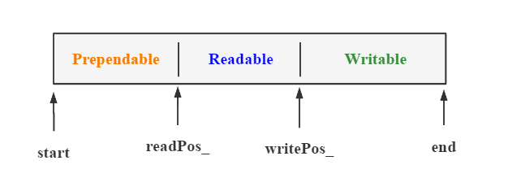

## SimpleWebServer

### 说明

该项目是对于 [markparticle/WebServer](https://github.com/markparticle/WebServer) 的复现及修改，对个人启发很大。

主要目的是辅助学习并实践网络编程，搭建 C++ web 服务器。

完成了以下环节：Buffer、Log、线程池、定时器、IO 复用、HTTP。

----

### Buffer

**Buffer** **布局**



初始情况下， `readPos_ = writePos_ = start = 0` ;

**读写操作**

一次读写操作，Buffer 内部变化如下：


**Makespace** **操作**

如果写入长度： $Writable < L2 \leq Prependable + Writable$​​，利用 **Prependable** 中内容扩容。本质就是将 `[readPos_, writePos_ )`  中的内容 **copy** 到 **start** 起点处。


如果写入长度： $L3 \geq Prependable + Writable$，则扩大 Buffer 大小：`writePos_ + L3 + 1`


----

### Log

利用单例模式与阻塞队列 ( **Blockqueue** ) 实现异步日志系统，记录服务器运行状态。

关于队列的操作都需要加锁！特别是 **push** 和 **pop** 操作，利用两个条件变量实现生产者消费者模式。


**push** 操作，主要是通过 `Log::write` 函数触发，代码中的 Log 内容先输入到 Buffer 中，后将 Buffer 中内容 **push** 到 **Blockqueue** 中。

Log 写线程 `thread(FlushLogThread)` 循环调用 **pop** 操作。**pop** 功能是将 **Blockqueue** 中相应内容取出，并最后写入到日志文件中。


----

### 线程池

将锁 `mtx` 、条件变量 `cond`、关闭标记 `isClosed` 和任务队列 `tasks` 集成与一个结构体 ***Pool*** 中，并由智能指针 ***shared_ptr*** `pool_` 指向该结构体。

线程池中线程数量： `threadCount` ，通过 **for** 循环创建对应数量的线程。

以 ***lambda*** 函数作为线程入口函数创建线程 `std::thread([pool = pool_] {...}).detach();`，并设置线程分离。其中所有的线程共享 `pool_`，他们使用共同的 **Pool** 结构体。

***lambda*** 函数内部是一个从任务队列取任务处理的过程。对任务队列的处理需要进行加锁，如果没有工作需要阻塞等待任务队列 **AddTask** 。

----

### 定时器

基于最小堆实现定时器，用来关闭超时的非活动连接；

> 最小堆：父节点的值比每一个子节点的值都小！ :raising_hand_man: 注意：堆的根节点中存放的是最大或者最小元素，但是其他节点的排序顺序是未知的。  [数据结构：堆（Heap）](https://www.jianshu.com/p/6b526aa481b1)

**主要功能** ：

- 堆的调整函数，上滤 `siftup`，下滤 `siftdown`
- 节点的添加 `add`，删除 `del`，(增量)调整 `adjust`
- 删除特定节点并触发回调 `doWork`，心搏函数 `tick`
- 其他函数：`pop` 、`clear` 、交换节点 `SwapNode` 、获取距离最近一次超时的间隔 `GetNextTick`

**<font color = #FF8888>添加节点</font>** : `AddClient_` 操作时会调用 add 函数，同时会添加回调函数 `CloseCoon_`

操作1：如果是新节点 (以 fd 标记新旧节点 )，默认添加在堆尾，之后进行上滤操作即可。

操作2：如果是已有节点，也就是修改操作，需要根据情况进行调整：

​	:small_blue_diamond: 非叶子节点，且已经成功下滤，则无需进行上滤

​	:small_orange_diamond: 非叶子节点，但是没有成功下滤，则需要进行上滤

​	:small_blue_diamond: 叶子节点，无下滤操作，需要进行上滤

```c++
if(!siftdown_(i, heap_.size())) {
	siftup_(i);
}
```

**<font color = #FF8888>删除节点</font>** ：将要删除的节点换到队尾，之后调整堆，后与添加操作 2 相同。

**<font color = #FF8888>增量调整</font>** ：只要进行下滤操作即可。每次 `DealRead_` 和 `DealWrite` 操作就延后超时时间。

**<font color = #FF8888>心搏函数</font>** ：从头节点开始遍历，清除超时的定时器，并调用对应的回调函数。

----

### IO 复用

利用IO复用技术 epoll 与线程池实现多线程的 Reactor 高并发模型


----

### HTTP

HTTP 部分主要处理 用户的 HTTP 的请求并作出响应，其工作流程如下图所示 :


**process** 的处理借助了 `httprequest` 类和 `httpresponse` 类，分别用来解析 HTTP 请求和生成对应的 HTTP 响应。


-----

### 致谢

再次感谢！[@MARK](https://github.com/markparticle)

